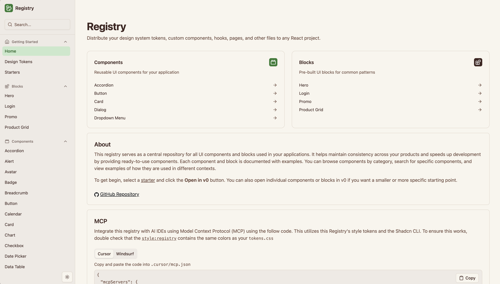

<a href="https://playful.ui.mustaquenadim.com">
  <h1 align="center">Playful UI</h1>
</a>

<p align="center">
  A playful, shadcn-compatible component registry. Browse the primitives and hundreds of variants,
  then install them with the shadcn CLI, open them in v0, or pull them in through MCP.
</p>

<p align="center">
  <a href="https://playful.ui.mustaquenadim.com"><strong>Live site</strong></a> ·
  <a href="#install-a-component"><strong>Install</strong></a> ·
  <a href="#mcp"><strong>MCP</strong></a> ·
  <a href="#running-locally"><strong>Running Locally</strong></a> ·
  <a href="#project-structure"><strong>Structure</strong></a> ·
  <a href="https://ui.shadcn.com/docs/registry"><strong>shadcn Registry Docs</strong></a>
</p>
<br/>

<!-- TODO: add a current screenshot of the site, e.g.  -->

## Requirements

Components follow shadcn/ui conventions and target:

- React 19
- Tailwind CSS v4 (Tailwind v3 projects will not style correctly)
- A project initialised with `npx shadcn@latest init`

Some components need extra libraries (`react-day-picker`, `input-otp`, `cmdk`, `@tanstack/react-table`, `date-fns`).
Each item lists its dependencies in its registry JSON, so the shadcn CLI installs them for you.

## Install a component

Every item is served as JSON from `/r/<name>.json`. Add one to any shadcn project:

```bash
npx shadcn@latest add https://playful.ui.mustaquenadim.com/r/button.json
```

Variants work the same way (`/r/comp-334.json`, etc.) and pull in their base primitive automatically.
Each component page also has buttons to copy the command (pnpm / npm / yarn / bun), copy the code,
or **Open in v0**. The full index lives at [`/r/registry.json`](https://playful.ui.mustaquenadim.com/r/registry.json).

## MCP

Use the registry from Claude Code, Cursor, VS Code or Windsurf via the shadcn MCP server.

1. Register the namespace in your project's `components.json`:

   ```json
   {
     "registries": {
       "@playful": "https://playful.ui.mustaquenadim.com/r/{name}.json"
     }
   }
   ```

2. Add the MCP server to your client config (e.g. `.mcp.json` for Claude Code, `.cursor/mcp.json` for Cursor):

   ```json
   {
     "mcpServers": {
       "shadcn": { "command": "npx", "args": ["shadcn@latest", "mcp"] }
     }
   }
   ```

   VS Code uses `.vscode/mcp.json` with a top-level `servers` key instead of `mcpServers`.

3. Ask your assistant, e.g. "Add the accordion from the @playful registry".

## Running locally

Requires Node.js and pnpm 10.

```bash
pnpm install
cp .env.example .env.local   # optional, sets the production URL used in commands
pnpm dev
```

Open [localhost:3000](http://localhost:3000).

| Script                | What it does                                                           |
| --------------------- | ---------------------------------------------------------------------- |
| `pnpm dev`            | Builds the registry JSON, then starts Next.js in dev mode              |
| `pnpm build`          | Builds the registry JSON, then a production Next.js build              |
| `pnpm registry:build` | Runs `shadcn build` on `registry-variants.json` and `registry.json` into `public/r` |
| `pnpm lint`           | Biome check (`pnpm lint:fix` to apply fixes)                           |

CI (`.github/workflows/pr.yml`) runs build and lint on every pull request.

## Theming

Design tokens live in [`src/app/globals.css`](./src/app/globals.css) and are mirrored in the `theme`
item of [`registry.json`](./registry.json), which is what consumers (and MCP) install. Change both
together. Fonts (Quicksand, Montserrat, Geist Mono) are loaded with `next/font/google` in
[`src/app/layout.tsx`](./src/app/layout.tsx). A live token overview is at `/tokens`.

## Variants

The variants in `src/components/variants` are ported from [Origin UI](https://originui.com)
and restyled for the Playful theme:

```bash
node scripts/port-origin-variants.mjs ../originui
```

The script maps Origin categories to our primitives, applies the theme fixes listed in `PATCHES`,
skips anything in `scripts/origin-exclude.txt`, and regenerates `registry-variants.json`.

## Authentication (optional)

The registry is public. To protect `/r/*`, set `REGISTRY_AUTH_TOKEN` and add a middleware that
checks a `token` search param:

```ts
// src/middleware.ts
import { type NextRequest, NextResponse } from "next/server";

export const config = { matcher: "/r/:path*" };

export function middleware(request: NextRequest) {
  const token = request.nextUrl.searchParams.get("token");
  if (token !== process.env.REGISTRY_AUTH_TOKEN) {
    return new NextResponse("Unauthorized", { status: 401 });
  }
  return NextResponse.next();
}
```

v0 passes the same `token` param when opening components. This only protects the JSON, not the preview pages.

## Project structure

```
registry.json             primitives, blocks and the theme item
registry-variants.json    Origin-derived variants (generated)
registry/                 shared files shipped with items (layouts, utils, css)
scripts/                  Origin UI porting script
src/app/(home)            home page and /ui/[name] primitive pages
src/app/(registry)        /registry/[name] item pages and /tokens
src/app/demo/[name]       standalone previews, also reused for home thumbnails
src/components/ui         shadcn/ui primitives
src/components/variants   comp-*.tsx variants
src/components/registry   site chrome: cards, sidebar, copy, v0, MCP tabs
public/r                  built registry JSON (generated)
```

## Contributing

Issues and pull requests are welcome at
[github.com/mustaquenadim/playful-ui](https://github.com/mustaquenadim/playful-ui).
Run `pnpm lint` and `pnpm build` before opening a PR; CI runs both.

## Credits

Built on Vercel's [Registry Starter](https://github.com/vercel/registry-starter) and
[shadcn/ui](https://ui.shadcn.com). Variants adapted from [Origin UI](https://originui.com)
(MIT, Copyright (c) 2025 Origin UI).

## License

Licensed under the [MIT License](./LICENSE). The Origin UI copyright notice is kept in that file.

Questions or feedback: [@mustaquenadim](https://github.com/mustaquenadim) on GitHub.
